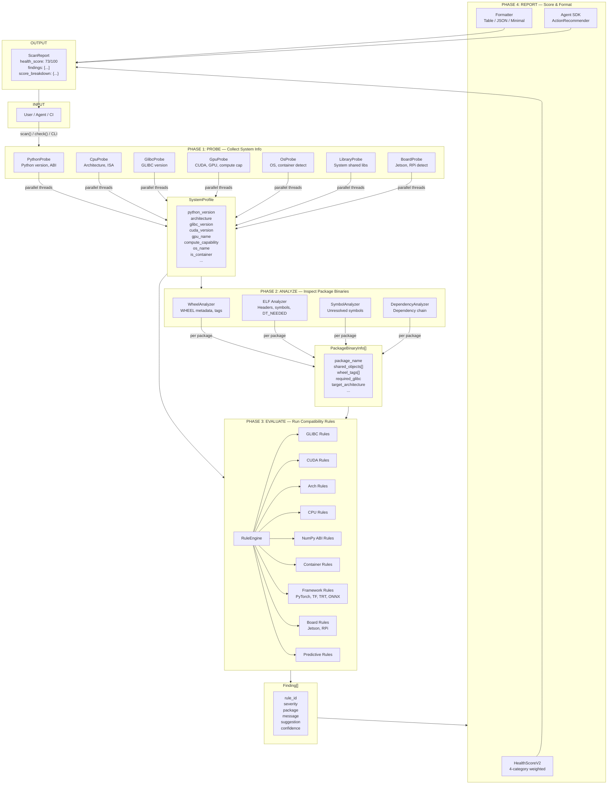
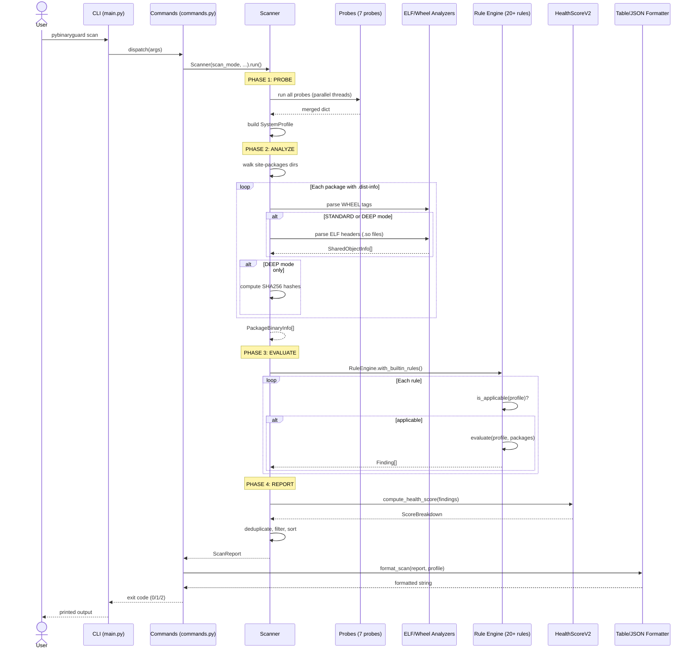
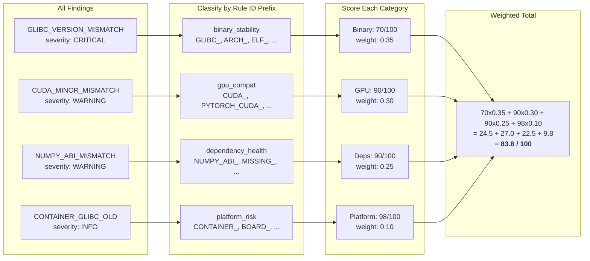
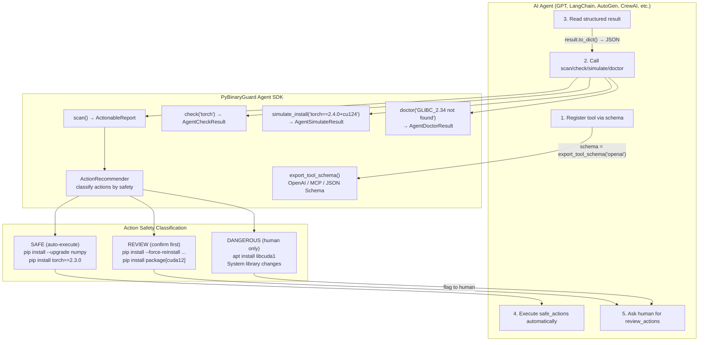
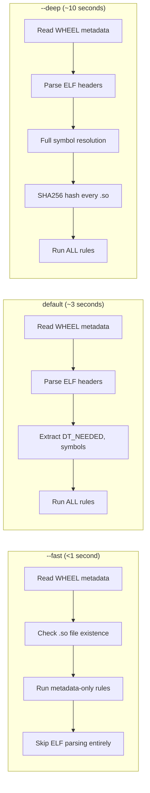
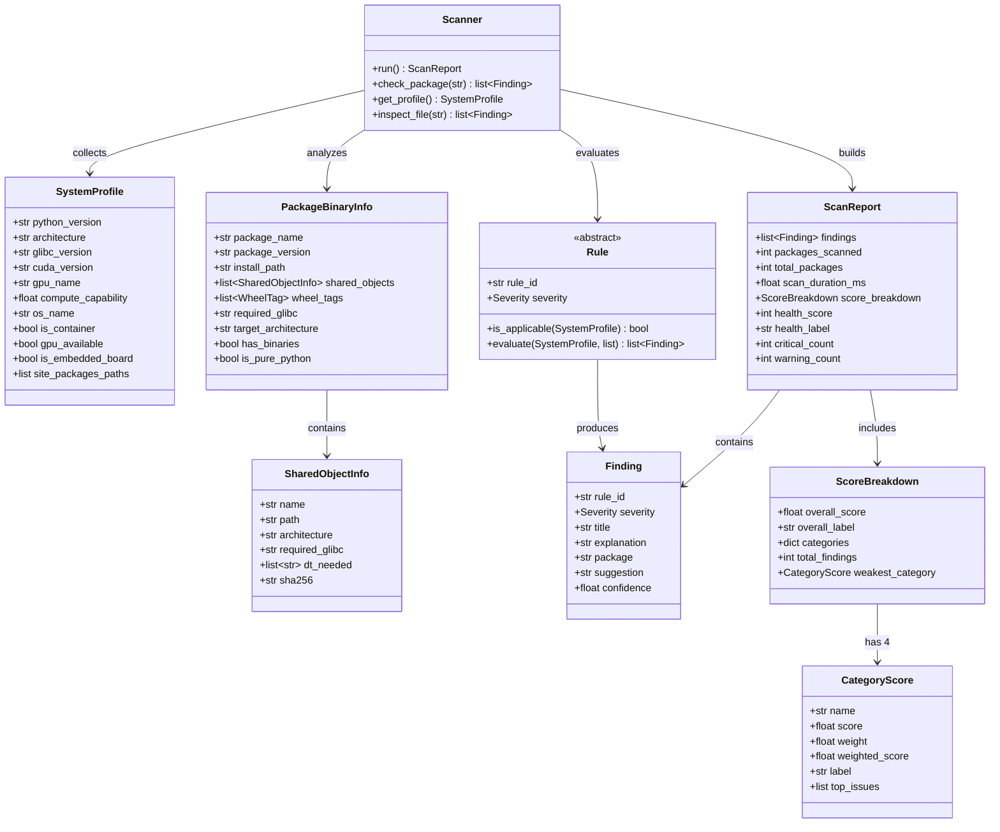

<p align="center">
  <a href="https://pypi.org/project/pybinaryguard/"></a>
  <a href="https://pypi.org/project/pybinaryguard/"></a>
  <a href="https://github.com/po-nuvai/pybinaryguard/stargazers"></a>
  
  
  
  
</p>

<h1 align="center">PyBinaryGuard</h1>

<p align="center">
  <strong>Binary Compatibility Intelligence for Python</strong><br>
  Detect incompatibilities <em>before</em> they crash your program.
</p>

<p align="center">
  <a href="#quick-start">Quick Start</a> &bull;
  <a href="#why-pybinaryguard">Why?</a> &bull;
  <a href="#features">Features</a> &bull;
  <a href="#cli-usage">CLI</a> &bull;
  <a href="#python-api">Python API</a> &bull;
  <a href="#agent-sdk">Agent SDK</a> &bull;
  <a href="#architecture">Architecture</a>
</p>

---

## Origin Story

Back in college, I was working on real-time object detection on an **NVIDIA Jetson TX2** — computer vision, image processing, and ML models for live detection. I spent weeks writing the code. Tested the logic. Verified every layer, every weight, every preprocessing step. The code had **zero errors**.

Then I hit run.

```
Illegal instruction (core dumped)
```

That's it. No traceback. No helpful message. Just — *"instruction unclear, core dumped."*

I stared at the screen. I checked the code again. **Nothing was wrong.** I rewrote parts of it. Same crash. I tried different package versions. Same crash. I searched Stack Overflow for hours. Nothing worked.

This went on for **days**. Every single day, the same cryptic error. I started questioning my own code, my understanding of Python, everything. It was pure rage.

Then one day I finally figured it out — it wasn't my code at all. The pip packages I installed were compiled for a different architecture. The CUDA toolkit version didn't match what PyTorch expected. The GLIBC on the Jetson was too old for the prebuilt wheels. The binaries simply didn't belong on that hardware.

**My code was perfect. The binaries were incompatible.**

And the worst part? There was no tool to tell me this. No `pip check` that catches binary mismatches. No scanner that says *"hey, this .so file needs GLIBC 2.34 but you only have 2.27."* Nothing.

I told myself: if I ever get the chance, I'll build the tool I wish I had during those sleepless nights on the Jetson. Something that looks at your system — your CPU, your GPU, your GLIBC, your CUDA — and tells you **what's actually wrong** before you waste another day blaming your own code.

That tool is **PyBinaryGuard**.

---

## The Problem

You install a Python package. Your code is correct. Your machine is fine. **It still crashes.**

```
ImportError: /lib/x86_64-linux-gnu/libm.so.6: version `GLIBC_2.34' not found
```

```
Illegal instruction (core dumped)
```

```
OSError: libcudart.so.12: cannot open shared object file
```

These aren't bugs in your code. They're **binary-level incompatibilities** between compiled C/C++ libraries inside Python packages and your system's hardware, OS, or drivers. No existing tool catches them before runtime.

**PyBinaryGuard does.**

---

## Why PyBinaryGuard?

| Tool | What it does | What it misses |
|------|-------------|----------------|
| `pip check` | Version conflicts | Binary/ABI compatibility |
| `ldd` | Shared library links | Python package context |
| `nvidia-smi` | GPU info | Cross-package CUDA conflicts |
| `file` | ELF metadata | Compatibility analysis |
| **PyBinaryGuard** | **All of the above, unified** | -- |

PyBinaryGuard is the **first tool** that correlates your Python version, CPU architecture, GLIBC version, CUDA toolkit, GPU compute capability, and installed package binaries into a single compatibility verdict.

---

## Quick Start

### Install

```bash
# Recommended — isolated CLI install (Ubuntu 24.04+, Debian 12+, etc.)
pipx install pybinaryguard

# Or per-user install
pip install --user pybinaryguard

# Or classic pip (inside a venv)
pip install pybinaryguard
```

> **Note:** On modern Linux distros (Ubuntu 24.04+, Debian 12+), system-wide
> `pip install` is blocked by PEP 668. Use `pipx` or a virtual environment.

### Use

```bash
# Run a full scan
pybinaryguard scan

# Check a specific package
pybinaryguard check torch

# Fast scan (metadata only, <1 second)
pybinaryguard scan --fast

# Deep scan (full symbol resolution + hash verification)
pybinaryguard scan --deep
```

### Install from source (for development)

```bash
git clone https://github.com/po-nuvai/pybinaryguard.git
cd pybinaryguard
python -m venv .venv && source .venv/bin/activate
pip install -e ".[dev]"
```

---

## Features

### Core Scanner
- **System Profiling** -- Detects Python version, CPU architecture (x86_64/aarch64/armv7l), GLIBC version, CUDA toolkit, GPU compute capability, container environment
- **Binary Analysis** -- Inspects `.so` shared objects inside installed packages using ELF header parsing and symbol resolution
- **20+ Built-in Rules** -- Covers GLIBC version requirements, CUDA ABI mismatches, CPU instruction set conflicts, architecture mismatches, NumPy ABI breaks, container-specific issues, and more
- **Plugin System** -- Extensible with custom probes, analyzers, and rules for Jetson, TensorRT, OpenCV, GStreamer

### Health Scoring v2
Multi-dimensional weighted scoring across 4 categories:

| Category | Weight | What it measures |
|----------|--------|------------------|
| Binary Stability | 35% | GLIBC, ELF, ABI issues |
| GPU Compatibility | 30% | CUDA, compute capability, driver mismatches |
| Dependency Health | 25% | Version conflicts, missing libraries |
| Platform Risk | 10% | Architecture, container, OS-specific issues |

Weights auto-adjust based on your system (e.g., no GPU = GPU weight redistributed).

### Scan Modes

| Mode | Speed | Depth | Use case |
|------|-------|-------|----------|
| `--fast` | <1s | Metadata only, skips ELF analysis | CI pipelines, quick checks |
| *(default)* | ~3s | Full binary analysis | Development workflow |
| `--deep` | ~10s | Symbol resolution + SHA256 hashes | Security audits, production deploys |

### Board Profile Engine
Built-in support for embedded/edge platforms:
- **NVIDIA Jetson** (Nano, TX2, Xavier, Orin)
- **Raspberry Pi** (3B, 4B, 5, Zero 2W)
- Custom board profiles via plugin system

### AI Framework Inspection
Specialized checks for ML/AI stacks:
- PyTorch CUDA ABI compatibility
- PyTorch + TorchVision version matrix
- TensorFlow compute capability requirements
- TensorRT version compatibility
- ONNX Runtime execution provider validation

### Predictive Failure Engine
Predicts runtime failures before they happen:
- Import error prediction based on dependency chain analysis
- Unresolved symbol detection
- Cross-package ABI conflict detection

### Environment Snapshots
Lock and verify your binary environment:

```bash
# Create a snapshot
pybinaryguard snapshot -o env.lock.json

# Verify against snapshot on another machine
pybinaryguard verify env.lock.json
```

---

## CLI Usage

```
pybinaryguard <command> [options]

Commands:
  scan                Full environment scan
  check <package>     Check a specific package
  profile             Show system profile
  doctor              Interactive troubleshooting
  inspect <file>      Analyse a .whl or .so file
  snapshot            Create environment snapshot
  verify <lockfile>   Verify against snapshot
  simulate <spec>     Predict compatibility before install
  export-tool-schema  Export agent tool schema

Global Options:
  --format {table,json,minimal}   Output format (default: table)
  --severity {critical,warning,info,all}
  --fast / --deep                 Scan depth
  --ci                            CI mode (minimal + strict exit codes)
  --ignore RULE_ID [...]          Rules to skip
  --timeout SECONDS               Max scan time (default: 30)
  --no-color                      Disable coloured output
  -v, --verbose                   Show technical details
  -q, --quiet                     Critical findings only
```

### Exit Codes

| Code | Meaning |
|------|---------|
| 0 | All clear |
| 1 | Warnings found |
| 2 | Critical issues found |
| 3 | Scanner error |

### CI/CD Integration

```yaml
# GitHub Actions
- name: Binary compatibility check
  run: |
    pip install pybinaryguard
    pybinaryguard scan --ci
```

```Dockerfile
# Docker health check
HEALTHCHECK CMD pybinaryguard scan --fast --ci || exit 1
```

---

## Python API

```python
import pybinaryguard

# Full environment scan
report = pybinaryguard.scan()
print(f"Health: {report.health_score}/100")
print(f"Issues: {report.total_findings}")

for finding in report.findings:
    print(f"[{finding.severity}] {finding.rule_id}: {finding.message}")
    if finding.suggestion:
        print(f"  Fix: {finding.suggestion}")

# Check a single package
findings = pybinaryguard.check("torch")

# Get system profile
profile = pybinaryguard.profile()
print(f"Python: {profile.python_version}")
print(f"GLIBC: {profile.glibc_version}")
print(f"Arch: {profile.architecture}")
print(f"CUDA: {profile.cuda_version}")

# Inspect a wheel file before installing
findings = pybinaryguard.inspect("torch-2.4.0-cp311-cp311-manylinux1_x86_64.whl")
```

---

## Agent SDK

PyBinaryGuard is **agent-native** -- designed for AI agents and automation pipelines to consume directly.

### Structured Output

```python
from pybinaryguard.agent import scan, check, simulate_install, doctor

# Returns machine-readable ActionableReport
report = scan()
report.to_dict()  # JSON-serializable

# Classified actions with safety levels
report.safe_actions      # Auto-executable (e.g., pip install --upgrade)
report.review_actions    # Needs human confirmation
report.dangerous_actions # Human-only (e.g., system library changes)

# Pre-install simulation
sim = simulate_install("torch==2.4.0+cu124")
sim.predicted_compatible  # True/False
sim.confidence            # 0.0-1.0
sim.blockers              # List of blocking issues

# Error diagnosis
dx = doctor("GLIBC_2.34 not found")
dx.diagnosis       # What went wrong
dx.fix_plan        # Step-by-step fix
dx.auto_fix_safe   # Can an agent fix this automatically?
```

### Tool Schema Export

Register PyBinaryGuard as a tool in any agent framework:

```python
from pybinaryguard.agent import export_tool_schema

# OpenAI function calling format
schema = export_tool_schema(format="openai")

# MCP (Model Context Protocol) format
schema = export_tool_schema(format="mcp")

# Generic JSON Schema
schema = export_tool_schema(format="json_schema")
```

```bash
# CLI export
pybinaryguard export-tool-schema --schema-format openai
pybinaryguard export-tool-schema --schema-format mcp
```

### One-Liner Agent Registration

```python
from pybinaryguard.agent import as_agent_tool

# Returns {schema: ..., handlers: {scan: fn, check: fn, ...}}
tool = as_agent_tool()
```

### Runtime Import Guard

Capture and diagnose import failures in real-time:

```python
from pybinaryguard.agent.guard import guarded_imports

with guarded_imports() as guard:
    import torch  # If this fails, guard captures structured diagnostics

for error in guard.captured_errors:
    print(error["category"])   # e.g., "glibc_mismatch"
    print(error["diagnosis"])  # Human-readable explanation
```

---

## How It Works (UML Diagrams)

### Core Scan Pipeline

The entire library follows a 4-phase pipeline: **Probe → Analyze → Evaluate → Report**.



### Sequence Diagram — Full Scan Flow

Step-by-step execution when a user runs `pybinaryguard scan`:



### Health Scoring Model

How the multi-dimensional health score is calculated:



### Agent SDK Flow

How AI agents interact with PyBinaryGuard:



### Scan Mode Comparison



### Class Diagram — Core Data Model



---

## Project Structure

```
pybinaryguard/
|
|-- pyproject.toml               # Packaging config (PEP 621)
|-- README.md
|-- LICENSE
|-- CHANGELOG.md
|-- .gitignore
|
|-- src/
|   +-- pybinaryguard/
|       |-- __init__.py          # Public API (scan, check, profile, inspect)
|       |-- scanner.py           # Core orchestrator
|       |
|       |-- models/              # Data structures
|       |   |-- system.py        # SystemProfile dataclass
|       |   |-- finding.py       # Finding, ScanReport
|       |   |-- package.py       # PackageBinaryInfo, SharedObjectInfo
|       |   +-- enums.py         # Severity, ScanMode
|       |
|       |-- probes/              # System information collectors
|       |   |-- os_probe.py      # OS, GLIBC, container detection
|       |   |-- python_probe.py  # Python version, ABI flags
|       |   |-- cpu_probe.py     # Architecture, instruction sets
|       |   |-- gpu_probe.py     # CUDA, GPU compute capability
|       |   |-- glibc_probe.py   # GLIBC version detection
|       |   |-- library_probe.py # System shared library inventory
|       |   +-- board_probe.py   # Embedded board detection (Jetson, RPi)
|       |
|       |-- analyzers/           # Package binary inspectors
|       |   |-- elf_analyzer.py  # ELF header & symbol table parsing
|       |   |-- wheel_analyzer.py
|       |   |-- symbol_analyzer.py
|       |   +-- dependency_analyzer.py
|       |
|       |-- rules/               # Compatibility rule engine
|       |   |-- engine.py        # Rule evaluation orchestrator
|       |   +-- builtin/         # 20+ built-in rules
|       |       |-- glibc_rules.py
|       |       |-- cuda_rules.py
|       |       |-- arch_rules.py
|       |       |-- cpu_rules.py
|       |       |-- numpy_rules.py
|       |       |-- container_rules.py
|       |       |-- python_abi_rules.py
|       |       |-- board_profile_rules.py
|       |       |-- framework_rules.py
|       |       +-- predictive_rules.py
|       |
|       |-- scoring/             # Health scoring v2
|       |   +-- engine.py        # Multi-dimensional weighted scoring
|       |
|       |-- profiles/            # Board profile engine
|       |   +-- engine.py        # Board detection & matching
|       |
|       |-- diagnostics/         # Error explanation
|       |   |-- findings.py
|       |   |-- explainer.py
|       |   +-- suggestions.py
|       |
|       |-- agent/               # Agent SDK
|       |   |-- tool_interface.py
|       |   |-- recommender.py
|       |   |-- schema.py        # Tool schema export (OpenAI/MCP)
|       |   |-- simulator.py     # Pre-install compatibility prediction
|       |   +-- guard.py         # Runtime import guard
|       |
|       |-- plugins/             # Plugin system
|       |   |-- loader.py
|       |   |-- hooks.py
|       |   +-- contrib/         # Built-in plugins (Jetson, TensorRT, OpenCV, GStreamer)
|       |
|       +-- cli/                 # Command-line interface
|           |-- main.py          # Argument parser
|           |-- commands.py      # Command handlers
|           +-- formatters.py    # Output formatting (table/json/minimal)
|
|-- tests/                       # 505 tests
|-- docs/                        # Documentation
+-- examples/                    # Usage examples
```

### Design Principles

1. **Zero dependencies by default** -- Core functionality works with just the Python standard library. Optional `pyelftools` enables deep ELF analysis.

2. **Read-only** -- Never modifies your system, packages, or files. Safe to run anywhere.

3. **Offline-first** -- No network calls. All analysis runs locally. Works in air-gapped environments.

4. **Agent-native** -- Structured JSON-serializable outputs. Tool schema export. Safety-classified actions.

5. **Extensible** -- Plugin system for custom probes, analyzers, and rules via entry points.

---

## Supported Platforms

| Platform | Architecture | Status |
|----------|-------------|--------|
| Ubuntu 20.04+ | x86_64 | Fully supported |
| Ubuntu 20.04+ | aarch64 | Fully supported |
| Debian 11+ | x86_64 / aarch64 | Fully supported |
| RHEL / CentOS 8+ | x86_64 | Supported |
| Alpine (musl) | x86_64 | Supported |
| NVIDIA Jetson | aarch64 | Supported (board profiles) |
| Raspberry Pi OS | armv7l / aarch64 | Supported (board profiles) |
| Docker containers | any | Supported (auto-detected) |

---

## Testing

```bash
# Run all tests (505 tests)
python -m pytest tests/ -v

# Run with coverage
python -m pytest tests/ --cov=pybinaryguard --cov-report=term-missing

# Run specific test suites
python -m pytest tests/test_scoring.py -v      # Health scoring
python -m pytest tests/test_scan_modes.py -v   # Scan modes
python -m pytest tests/test_agent_sdk.py -v    # Agent SDK
```

---

## Author

**S P Pothihai Selvan** (Po-nuvai)
Applied Research Scientist @ [Nuvai AI Solution Pvt Ltd](https://nuvai.dev)

---

## License

MIT License. See [LICENSE](LICENSE) for details.
